## Image-classification

思考方式：高维空间和图像相结合


面对的挑战：

* 同一个对象，不同视角
* 不同光照条件
* 对象的变形
* 被遮挡的对象
* background clutter: 背景混乱，也就是背景和对象的纹理十分相像
* intraclass variation: 类内差异，每一个同类物体都有不同的大小形状等等


对每一个对象提取边缘？

该方法不可移植，对于每一个对象都需要重新找到一系列边缘


数据驱动的方法：

* 抓取图片数据集合标签
* 用机器学习训练分类器
* 在新的图片上评估分类器

```python
def train(images, labels):
    return model

def predicti(model, test_images):
    return test_labels
    
```

### Nearest Neighbor classifier


#### Nearest Neighbor

思想：

* train阶段，记录data和labels
* predict阶段，找到和test image最相近的training image，基于此给出标签


如何比较两张图片？什么是最相近？

L1 distance（曼哈顿距离）

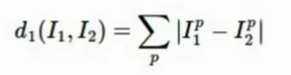

* 两张图片中每一个对应像素点像素值相减得到差值

* 所有差值相加
* 差值最小的即为最相近


算法效率：

* train O(1)
* predict O(N)

bad，运算量最大最慢的应该在train阶段，而非predict阶段


可见分类的情况有些粗糙，可能会因为噪音等等出现个别点分类问题


#### K-Nearest Neighbor

思想：

* 相较于上一个算法，该算法找到距离最近的K个点，在这些相邻点中进行投票，投票数最多的作为最近点


选择不同的K对分类结果的影响？

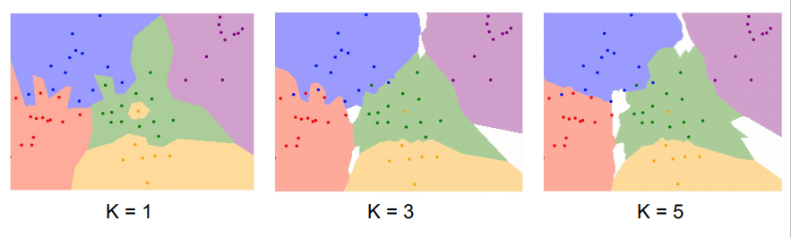

该方法下的分类效果，决策边界更加平滑

其中白色的是无分类的区域


还有什么衡量距离的方式？

L2：欧氏距离


改变坐标轴系统对L1有影响，对L2无影响，因此如果是比较有意义的向量可能用L1更好

而事实上通过定义距离，这个距离作用的对象可以是图像、文本，最后KNN可以泛化到多种数据上


选择不同的距离度量对结果的影响？

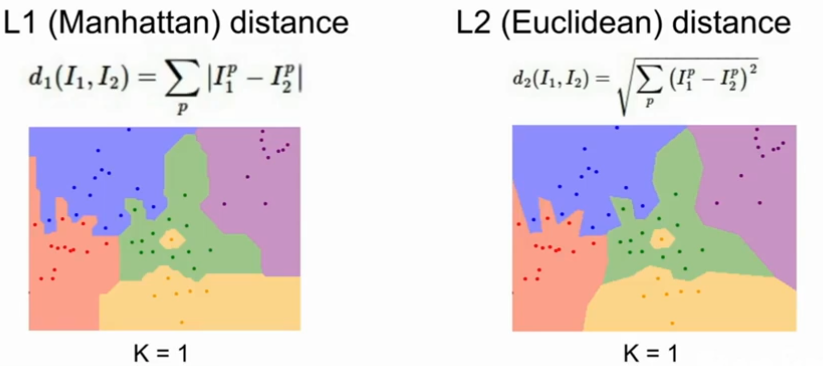

观察L1 L2的决策边界，前者的方向更趋向于坐标轴，而后者则不是


####  Hyperparameters

算法中不能通过训练学习得到的参数

比如说K、distance这一类，我们需要为算法提前进行选择

如何选择？常常基于具体问题，多次尝试


如何评估哪个参数表现最好？

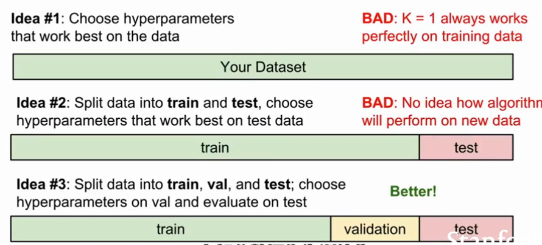


四种想法：

* 第一种划分方式选取的超参数仅仅只能说明在训练集上的效果好
* 第二种可能仅仅在测试集上的效果好
* 常见的方式：划分为三个部分，其中一个是验证集
  * train：用于训练算法
  * test：用于评估
  * validaion：选择表现最好的
* 第四种是交叉验证，划分为不同fold，循环验证，但因为计算代价，这种方式不常用


学生提问：

* 测试集能否很好的代表真实数据？这个基于统计学假设，每一个数据互相独立，服从同一分布，但是在收集数据集的时候必须要遵循相同方法。


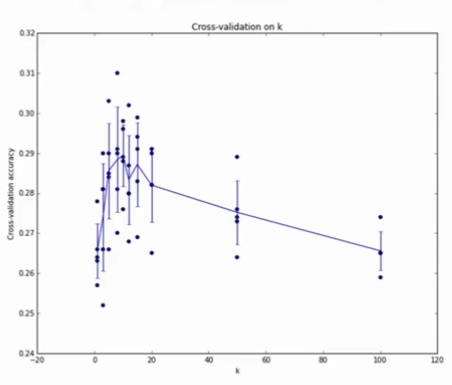

x轴为k，y轴为数据准确率，5-fold 交叉验证方法，通过绘图，我们可以看出哪一个k表现比较好


但事实上，我们不在图像上使用KNN算法，出于几个方面的原因：

* 在test阶段运算量大，速度慢
* 这样的距离度量方式不适合于比较图像之间的视觉相似度
* 维度灾难：该方法更需要样本在空间内比较均匀的分布，这需要指数级增加数据量


#### summary


## Linear Classification


相较于KNN，它不需要保留原始的训练数据，仅仅总结得出权重矩阵W，因此在做预测的时候更有效率


b是一些独立的偏好值，比如说猫和狗的数据量不同，不同这个偏移量你就可以做出一些调整


解释：

一种角度，从Wx开始


线性分类类似于一种模板匹配的方式，即某一类的模板和输入图像中的联系


通过f(x,W)=Wx+b的变换我们可以尝试理解这里发生了什么

可见在线性分类器中，**每一种类只有一个模板**，如果某一类出现了变体，它就必须求均值找到一个单独的综合的东西


比如说在这个horse的例子中，可以看出计算机在寻找一些东西，比如说青，但是图中的马出现了两个头（估计是有些训练集的图像是马头向左的，有些向右的）


另一种角度，回归到点和高维空间的概念，其目标是学习得到高维空间中的一个线性决策边界


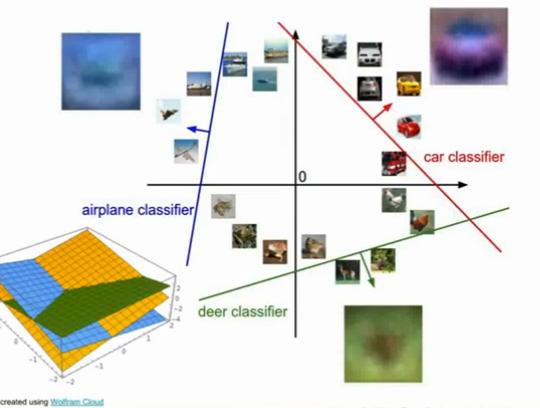


每一个图像相当于高维空间的一个点，而分类器在尝试划出一个分类面(蓝线、红线···)


### loss function

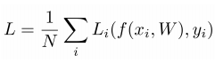

目标：用损失函数定量描述训练结果好坏，衡量W的好坏

另外，这个形式其实是一种评估的通用方法


一个具体的实例：

多类别SVM损失函数

example：(xi, yi)，其中yi是这个样本正确的分类标签

scores vector:  s=f(x1,W)


主要过程：

* 注意这个损失函数的形式，yi是真正的分类，j不等于yi，即我们只在错误的分类上做和
* 比较正确分类的分数和错误分类的分数，若正确分类的分数比错误分数高出一个safety margin（这里为1），那么损失为0
* 记录所有错误分类损失总和，得到对这个样本的最终损失
* 对整个训练集的损失取平均

其他：

* 说写成if then结构代码可读性更好
* 关于这个margin=1，其实我们更在意的是分数的相对差值而不是绝对值，也就是一定要让正确分类的分数在某种意义下远超过错误分类（**具体推导看讲义**）
* 这种和0取max的损失函数形式也就叫做合页损失函数（hinge loss）

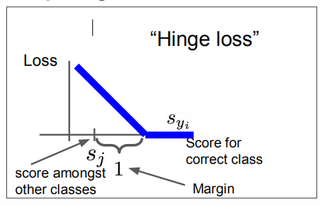

X轴是s_yi，是训练样本真实分类的分数

y轴是loss

随着真实分类分数的上升，Loss下降，最后到了某一个阈值，Loss降为0，此时对样本正确分类

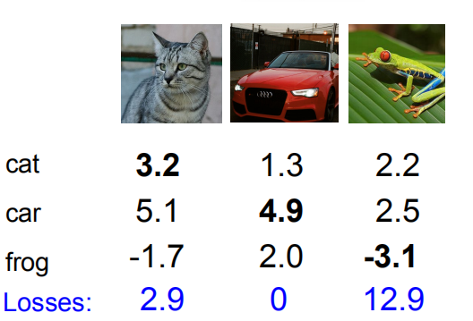

比较有意义的想法是去思考一些<u>改变</u>对代价函数造成的影响

Q1：改变汽车的分数，损失函数如何变化

损失函数不会发生变化，如果只改变了一点点，那么还是维持在安全边界之上，此时不会有变化

Q2：SVM损失函数可能的最大最小值？

min：zero

max：infinity

Q3：如果所有的s都近乎为0且差不多相等，损失函数如何？

应该为1*(c-1)

刚开始训练的时候，W等参数还比较小，因此通过这个我们可以得知损失函数的预期大小，也可以通过这个结论判断我们的程序是否正确

Q4：如果对所有的正确结果求和，损失函数是多少？

损失函数+1（对于正确结果，每个样本的损失函数+1，最后取平均还是+1）

Q5：如果使用平均值而不是求和呢？

这只是对损失函数做了一个缩放，不会影响结果

Q6：如果在损失函数的max里面加上一个平方呢？


这样就是另一种损失函数了

学生提问：为什么要用平方项呢？

* 损失函数的意义是量化错误的情况有多坏，去衡量这个分类器的错误有多坏，告诉你这是什么类型的错误，因此不同的项数（比如这里的线性和平方），意味着我们对不同错误的侧重程度

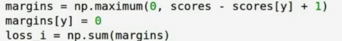

这里单独把那个类置0，而不需迭代（嗯，我也经常用这个技巧）


假设我们找到了一个W使得Loss=0，那么这个W唯一么？

* 显然不是，W放大缩小不影响结果


那么既然有这么多W，如何选择呢？

* 这个问题在于，我们在这里只关心了分类器在训练集上的表现，也就是Data loss，而没有考虑在测试集上的效果
* 这就要引出过拟合，正则化等问题


### regularization


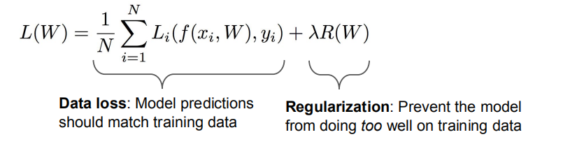


加入正则项（惩罚项R，超参数lambda），倾向于令其选择一个简单的W

这里也用到了Occam's Razor的思想：科学发现要让一个理论的应用更广泛


不同的正则化方式对模型复杂度的衡量方式不同


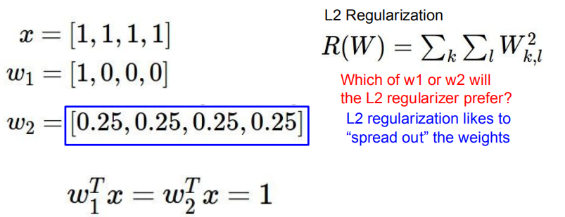

若采用L2，此时wx线性结果相同，正则化结果w2更小

因此可以说W的意义是一种对x的改造进而对输出的影响，而L2的意义更近似于x内不同元素之间的影响，是对整个W而言的


在类似的例子中，若采用L1，更倾向于选择w1，老师猜测L1更倾向于稀疏解

### softmax loss

在前面的SVM中，我们并没有真正解释score的含义，利用softmax函数，我们原始的得分都变成了概率，那么我们的目标就是在这个正确分类上的概率为1

此时有代价函数


Q1：这个损失函数的最小值和最大值？

min: 0

max: infinity

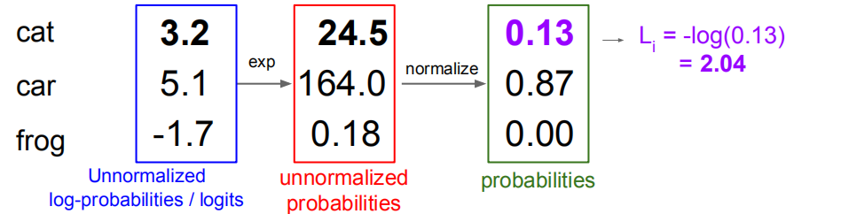

完全正确与完全错误的时候，概率分别为0和1，而log(1)=0，此时损失为0，而要得到0和1，我们的数字需要非常极端，但是在实际中我们不会得到这么精确的数值。


Q2：初始值的时候W比较小，此时s趋近于0，那么此时loss是多少？

log(c)????(啊！！！！！我傻了，log(1/c) = -log(c)啊，mmp


### softmax VS svm


两者的一些差异：

* 在svm中，我们考虑过一个问题，将车的打分稍稍提高，是否会对最终的结果有所影响，事实上因为车的分数已经很高了，正确打分和错误打分的相差已经超过了安全边际，因此不会造成影响。
* 而在softmax中，如果我们将一个分数提高，正确的趋向正无穷必定导致错误的趋向负无穷。
* 因此，总的来说，svm在处理的时候只要超过了一个安全边界，这个分类器就不会再关心这个数据点，而softmax则是不断推进数据点更加好。


一个非常典型的监督模型


## Optimization

快速下山系列

直接得到一个最低的minimize结果是不太可行的，因为我们的有各种复杂的函数结构，因此我们常常从一处开始不断的进行迭代


对于一元来说，导数就是函数某一点处的斜率

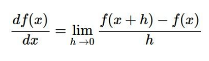

推广到多元

多元概念下的所生成的导数就是梯度，也就是偏导数组成的向量，它的每个元素可以告诉我们在相关方向上，函数f的斜率

这个梯度就指向了函数增长最快的方向，负梯度就指向了函数减少最快的方向


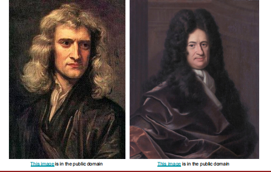

thanks to these guys，我们不需要用有限元法来计算

一些总结：

* 在实际使用中，我们可能不会使用数值梯度（就是用数值去估计，应该就是有限元计算），因为这样算起来太慢了，但是它也是有意义的
* 数值梯度可以用来debug，用它作为单元测试来保证自己的解析梯度是正确的

* 解析梯度


### gradient descent

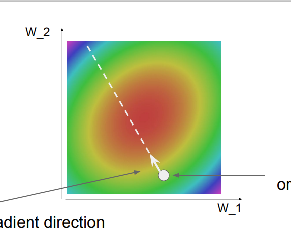

bow shape

向着红色进发！！！

### Stochastic Gradient Descent

在实际中，N非常的大，因此如果采用常规的梯度下降方法，速度会非常的慢

SGD方法在每一次迭代中选取一小部分训练样本，成为minibatch(ex: 34/64/128)，用来估计全部误差和梯度。

http://vision.stanford.edu/teaching/cs231n-demos/linear-classify/


### image feature

bags of word


## 疑惑

* 数值梯度是个什么玩意，哦？？有限元去估计
* 蒙特卡洛？


