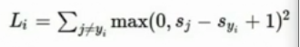
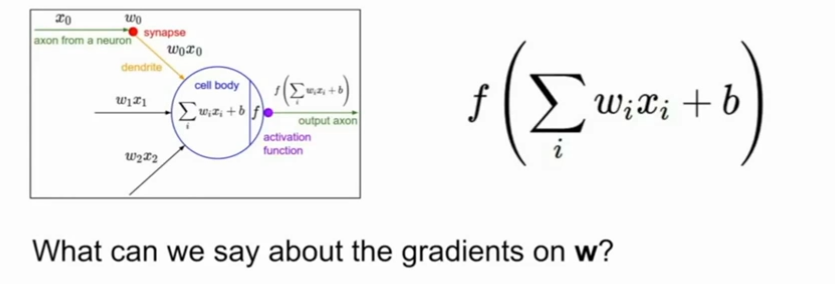
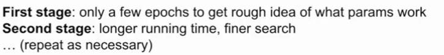

## Image-classification

思考方式：高维空间和图像相结合


面对的挑战：

* 同一个对象，不同视角
* 不同光照条件
* 对象的变形
* 被遮挡的对象
* background clutter: 背景混乱，也就是背景和对象的纹理十分相像
* intraclass variation: 类内差异，每一个同类物体都有不同的大小形状等等


对每一个对象提取边缘？

该方法不可移植，对于每一个对象都需要重新找到一系列边缘


数据驱动的方法：

* 抓取图片数据集合标签
* 用机器学习训练分类器
* 在新的图片上评估分类器

```python
def train(images, labels):
    return model

def predicti(model, test_images):
    return test_labels
    
```

### Nearest Neighbor classifier


#### Nearest Neighbor

思想：

* train阶段，记录data和labels
* predict阶段，找到和test image最相近的training image，基于此给出标签


如何比较两张图片？什么是最相近？

L1 distance（曼哈顿距离）


* 两张图片中每一个对应像素点像素值相减得到差值

* 所有差值相加
* 差值最小的即为最相近


算法效率：

* train O(1)
* predict O(N)

bad，运算量最大最慢的应该在train阶段，而非predict阶段


可见分类的情况有些粗糙，可能会因为噪音等等出现个别点分类问题


#### K-Nearest Neighbor

思想：

* 相较于上一个算法，该算法找到距离最近的K个点，在这些相邻点中进行投票，投票数最多的作为最近点


选择不同的K对分类结果的影响？


该方法下的分类效果，决策边界更加平滑

其中白色的是无分类的区域


还有什么衡量距离的方式？

L2：欧氏距离


改变坐标轴系统对L1有影响，对L2无影响，因此如果是比较有意义的向量可能用L1更好

而事实上通过定义距离，这个距离作用的对象可以是图像、文本，最后KNN可以泛化到多种数据上


选择不同的距离度量对结果的影响？


观察L1 L2的决策边界，前者的方向更趋向于坐标轴，而后者则不是


####  Hyperparameters

算法中不能通过训练学习得到的参数

比如说K、distance这一类，我们需要为算法提前进行选择

如何选择？常常基于具体问题，多次尝试


如何评估哪个参数表现最好？


四种想法：

* 第一种划分方式选取的超参数仅仅只能说明在训练集上的效果好
* 第二种可能仅仅在测试集上的效果好
* 常见的方式：划分为三个部分，其中一个是验证集
  * train：用于训练算法
  * test：用于评估
  * validaion：选择表现最好的
* 第四种是交叉验证，划分为不同fold，循环验证，但因为计算代价，这种方式不常用


学生提问：

* 测试集能否很好的代表真实数据？这个基于统计学假设，每一个数据互相独立，服从同一分布，但是在收集数据集的时候必须要遵循相同方法。


x轴为k，y轴为数据准确率，5-fold 交叉验证方法，通过绘图，我们可以看出哪一个k表现比较好


但事实上，我们不在图像上使用KNN算法，出于几个方面的原因：

* 在test阶段运算量大，速度慢
* 这样的距离度量方式不适合于比较图像之间的视觉相似度
* 维度灾难：该方法更需要样本在空间内比较均匀的分布，这需要指数级增加数据量


#### summary


## Linear Classification


相较于KNN，它不需要保留原始的训练数据，仅仅总结得出权重矩阵W，因此在做预测的时候更有效率


b是一些独立的偏好值，比如说猫和狗的数据量不同，不同这个偏移量你就可以做出一些调整


解释：

一种角度，从Wx开始


线性分类类似于一种模板匹配的方式，即某一类的模板和输入图像中的联系


通过f(x,W)=Wx+b的变换我们可以尝试理解这里发生了什么

可见在线性分类器中，**每一种类只有一个模板**，如果某一类出现了变体，它就必须求均值找到一个单独的综合的东西


比如说在这个horse的例子中，可以看出计算机在寻找一些东西，比如说青，但是图中的马出现了两个头（估计是有些训练集的图像是马头向左的，有些向右的）


另一种角度，回归到点和高维空间的概念，其目标是学习得到高维空间中的一个线性决策边界


每一个图像相当于高维空间的一个点，而分类器在尝试划出一个分类面(蓝线、红线···)


### loss function


目标：用损失函数定量描述训练结果好坏，衡量W的好坏

另外，这个形式其实是一种评估的通用方法


一个具体的实例：

多类别SVM损失函数

### svm

example：(xi, yi)，其中yi是这个样本正确的分类标签

scores vector:  s=f(x1,W)


主要过程：

* 注意这个损失函数的形式，yi是真正的分类，j不等于yi，即我们只在错误的分类上做和
* 比较正确分类的分数和错误分类的分数，若正确分类的分数比错误分数高出一个safety margin（这里为1），那么损失为0
* 记录所有错误分类损失总和，得到对这个样本的最终损失
* 对整个训练集的损失取平均

其他：

* 说写成if then结构代码可读性更好
* 关于这个margin=1，其实我们更在意的是分数的相对差值而不是绝对值，也就是一定要让正确分类的分数在某种意义下远超过错误分类（**具体推导看讲义**）
* 这种和0取max的损失函数形式也就叫做合页损失函数（hinge loss）


X轴是s_yi，是训练样本真实分类的分数

y轴是loss

随着真实分类分数的上升，Loss下降，最后到了某一个阈值，Loss降为0，此时对样本正确分类


比较有意义的想法是去思考一些<u>改变</u>对代价函数造成的影响

Q1：改变汽车的分数，损失函数如何变化

损失函数不会发生变化，如果只改变了一点点，那么还是维持在安全边界之上，此时不会有变化

Q2：SVM损失函数可能的最大最小值？

min：zero

max：infinity

Q3：如果所有的s都近乎为0且差不多相等，损失函数如何？

应该为1*(c-1)

刚开始训练的时候，W等参数还比较小，因此通过这个我们可以得知损失函数的预期大小，也可以通过这个结论判断我们的程序是否正确

Q4：如果对所有的正确结果求和，损失函数是多少？

损失函数+1（对于正确结果，每个样本的损失函数+1，最后取平均还是+1）

Q5：如果使用平均值而不是求和呢？

这只是对损失函数做了一个缩放，不会影响结果

Q6：如果在损失函数的max里面加上一个平方呢？



这样就是另一种损失函数了

学生提问：为什么要用平方项呢？

* 损失函数的意义是量化错误的情况有多坏，去衡量这个分类器的错误有多坏，告诉你这是什么类型的错误，因此不同的项数（比如这里的线性和平方），意味着我们对不同错误的侧重程度


这里单独把那个类置0，而不需迭代（嗯，我也经常用这个技巧）


假设我们找到了一个W使得Loss=0，那么这个W唯一么？

* 显然不是，W放大缩小不影响结果


那么既然有这么多W，如何选择呢？

* 这个问题在于，我们在这里只关心了分类器在训练集上的表现，也就是Data loss，而没有考虑在测试集上的效果
* 这就要引出过拟合，正则化等问题


### regularization


加入正则项（惩罚项R，超参数lambda），倾向于令其选择一个简单的W

这里也用到了Occam's Razor的思想：科学发现要让一个理论的应用更广泛


不同的正则化方式对模型复杂度的衡量方式不同


若采用L2，此时wx线性结果相同，正则化结果w2更小

因此可以说W的意义是一种对x的改造进而对输出的影响，而L2的意义更近似于x内不同元素之间的影响，是对整个W而言的


在类似的例子中，若采用L1，更倾向于选择w1，老师猜测L1更倾向于稀疏解

### softmax loss

在前面的SVM中，我们并没有真正解释score的含义，利用softmax函数，我们原始的得分都变成了概率，那么我们的目标就是在这个正确分类上的概率为1

此时有代价函数


Q1：这个损失函数的最小值和最大值？

min: 0

max: infinity


完全正确与完全错误的时候，概率分别为0和1，而log(1)=0，此时损失为0，而要得到0和1，我们的数字需要非常极端，但是在实际中我们不会得到这么精确的数值。


Q2：初始值的时候W比较小，那么此时loss是多少？

此时s趋近于0，每个得分也是相同的，出来以后平均完还是这么大，

log(c)????(啊！！！！！我傻了，-log(1/c) = log(c)啊，mmp


### softmax VS svm


两者的一些差异：

* 在svm中，我们考虑过一个问题，将车的打分稍稍提高，是否会对最终的结果有所影响，事实上因为车的分数已经很高了，正确打分和错误打分的相差已经超过了安全边际，因此不会造成影响。
* 而在softmax中，如果我们将一个分数提高，正确的趋向正无穷必定导致错误的趋向负无穷。
* 因此，总的来说，svm在处理的时候只要超过了一个安全边界，这个分类器就不会再关心这个数据点，而softmax则是不断推进数据点更加好。


一个非常典型的监督模型


## Optimization

快速下山系列

直接得到一个最低的minimize结果是不太可行的，因为我们的有各种复杂的函数结构，因此我们常常从一处开始不断的进行迭代


对于一元来说，导数就是函数某一点处的斜率


推广到多元

多元概念下的所生成的导数就是梯度，也就是偏导数组成的向量，它的每个元素可以告诉我们在相关方向上，函数f的斜率

这个梯度就指向了函数增长最快的方向，负梯度就指向了函数减少最快的方向


thanks to these guys，我们不需要用有限元法来计算

一些总结：

* 在实际使用中，我们可能不会使用数值梯度（就是用数值去估计，应该就是有限元计算），因为这样算起来太慢了，但是它也是有意义的
* 数值梯度可以用来debug，用它作为单元测试来保证自己的解析梯度是正确的

* 解析梯度


### gradient descent


bow shape

向着红色进发！！！

### Stochastic Gradient Descent

在实际中，N非常的大，因此如果采用常规的梯度下降方法，速度会非常的慢

SGD方法在每一次迭代中选取一小部分训练样本，成为minibatch(ex: 34/64/128)，用来估计全部误差和梯度。

http://vision.stanford.edu/teaching/cs231n-demos/linear-classify/


### image feature

因为多模态等种种原因，直接输入图像本身其结果是不太好的，在深度学习出现以前，人们常常采用这种方案


计算各种特征代表


通过特征转换，复杂的数据集会变得更加可分


color histogram

可以直观的看出颜色分量情况

HoG

边缘方向，得到不同边缘情况

bags of word

灵感来自于nlp词频


## Backpropagation and Neural Networks


### computational graphs


该图可以表示任何的函数，其中的节点代表了要执行的每一步计算

反向传播技术，递归地调用链式法则，计算图中的每一个中间变量的梯度

### Backpropagation


在这里我们想得到f在x y z上的梯度，也就是展示x y z对f的影响

如果我们需要计算f在y上的梯度，因为其中有一个加号，因此计算并不是直接的，利用链式法则分成了两步 -4 * 1 = -4


每一次都是对其中某一个计算节点的处理，相较于对于整个表达式的一次性处理，这种方式在复杂的表达式中会更加实用，因为每一个节点的梯度计算仅仅是一些基本的求导式子


每次正向经过一个节点，我们都可以得到local gradient，因此在计算出代价函数L以后，我们就已经得到了L在z上的导数，在反向传播中，这些数值从上游被传回，然后通过链式法则再得到之后的对下游的要传递的梯度值


计算本地梯度时的变量是当前节点的值


对于乘法节点和加法节点的计算可以参照前一个example

对于这个计算图，其拆解成节点的方式其实不唯一，并不一定要保持在最简的形式，你可以聚合任何的节点，只要你能够计算出该节点的梯度计算公式


### Patterns


可以看到这个加法器类似于一个分发器，对于上游传下来的梯度，它不做处理，然后发给下游（1*xxx = xxx）

Q1: what is a max gate?这个max gate的本地梯度是什么？


对其中一个节点为1（也就是最大值那个节点），对另一个节点为0，其功能类似于一个路由器。

我们还记得求f在x上的梯度相当于得到x对f的影响，因此在这个意义上，只有最大值z对其中的后续的变量产生了影响，那么计算梯度的时候，自然其分发给下游的时候只偏爱z

Q2：乘法门呢？

类似于一个switcher转换器，它收到上游传回来的梯度值，然后根据传入的两个变量情况进行缩放


出现分支时，我们需要将影响相加，在正向传播时，前面这个总节点的改变会对后面两个分支产生影响，同理在反向传播时，我们也要收集两个分支带来的影响


我们再看看拓展到高维向量的情况


注：雅克比


也就是输出的某个元素对输入的某个元素逐个偏导

雅克比矩阵是一个对角矩阵，因为这个计算其实是对每个元素分别进行的，所以仅有x_i对y_i有影响


计算W对q的影响，我们先取其中的一个元素也就是标量来看(不好意思，推导过程忘记加符号标记了)


这里的实际上是一个雅克比矩阵，也就是w的每一个元素对w的每一个元素的影响，我们不列出这个矩阵，因为它太大了

(这里W有问题，不要在意)


## L5: Neural Networks

堆叠形成一个比较复杂的非线性函数

激活函数类似于神经元的触发放电过程？


滑动遍历完整个图像得到激活映射：

* 滑动方式可自选，不同的滑动方式会得到不同维度的输出
* 通常有一组卷积核，因此每个卷积核都做一次计算，最后可以得到一组激活映射
* 

这个激活映射是28x28x（number of the filter）的，而非28x28x3

Convnet

多个卷积层堆叠构成的这么个东西


零填充


学生提问：

* 零填充是否增加了一些额外特征？

  这只是一种解决问题的方式，比如在这里我们希望它得到的输出还是原来的7x7  full size output


我们不希望规模随着处理迅速变小，那样会造成信息丢失（因为你拿着比较少的数据去做的处理），同时图像边角的信息也会不断丢失，所以经常用这种方式维持网络的规模


1是偏置项


和之前神经元的概念联系在一起：


5x5的filter有时候也被称为5x5 receptive field for each neuron，也就时神经元的感受野，也就时它能感受到的这个区域大小


比较一下全连接的方式和卷积的方式


可以看到卷积核中神经元只和图像的一个局部区域发生关联，而在全连接中一个神经元会和其他的整体发生联系


### Pooling layer

减少参数，让规模整体更加可控


不做深度上的处理，只做平面上的处理，这里输入和输出深度都是64x64

学生提问：

* 为什么最大值池化的效果要好于均值？

  每个区域内都是一组神经元，而激活值在某种意义上可以代表每个神经元的激活程度，而如果使用最大值池化，我们就可以得到这个区域内的激活程度，如果做检测等等用这种方式更加直观


注意：

* 一般不在池化层做填充，一般只在这里做降采样

### Fully connected Layer

http://cs.stanford.edu/people/karpathy/convnetjs/demo/cifar10.html


## L6：Training Neural Networks Part1

### Activation Function

**sigmod**


P1：输入过大和过小，Saturated neurons kill the gradients


* 当x=-10，此时梯度趋近于0，因此它传给下游节点的值也会特别小（链式法则相乘之后），导致最后得到了一个很小的梯度，我们无法得到梯度反馈
* 当x=0，此时都是很好的
* 当x=10，同样是0

P2：它不是一个零中心的函数

如果对一个神经元的输入总是正数，那么会发生什么？



对局部梯度来说，w的梯度其实就是

那么就意味着如果X全为正数，最终的梯度方向决定于上游传下来的dL/df，也就是仅仅把上游的符号传了过来，得到的梯度也全为正数或负数

这样的坏处在于，一旦上游传来了一个负值，那么只能向着负方向更新，正值同理


最终就只能像红色线条一样每次只能朝向一个轴的方向前进，梯度下降的过程很低效

所以要采用zero-mean的数据，就不会出现这个问题

（哦，所以把所有数据变成以零为中心的，那么最终的数据就会有正有负）


P3：（小问题）指数函数计算代价有点大


**tanh**


以零为中心，没有P2，但是依然有kill gradient的问题


**ReLU**


good：

* 在正值区域不会出现饱和现象
* 计算成本不高
* 有证明这个函数更贴近神经元的动作


bad：

* 非以0为中心
* 在负半轴的时候依然有饱和的现象，即梯度消失


在训练过程中，由于一次梯度更新的幅度过大，导致某些Relu节点的权重调整的太大，使得后续的训练对该节点不再起作用，这个节点相当于永久dead了（可能是调整的太大以后这一点就变负数了）


**Leaky ReLU**


### Data Processing


在图像处理中一般不做归一化，我猜测是图像中一些数据就已经代表了一些特征范围等等的问题

从测试数据中得到均值以后，我们再将同样的均值应用到测试数据中


### Weight initialization

如果W=0，会发生什么？

所有神经元的行为都会一致，会有相同的输出，同时得到相同的梯度，然后又得到了相同的更新，存在参数对称的问题


如果W取的是高斯分布的一组数字


此时权重为0.01,也就是我们取比较小的一组权重


可以看到标准差越来越小，也就是每层输入服从的分布越来越不像高斯分布，X比较小，而本地梯度正是输入x，这会导致最终反向传播的时候，本地梯度变得比较小。


如果我们不取0.01，而是用1相乘，得到一组比较大的权重

在通过tahn的时候会出现饱和现象


此时激活值趋于1，梯度趋于0，不再更新


Xavier initialization

输入方差==输出方差

（在讲义上有相关的内容）


在ReLU中


因为有半区域是被kill的，我们只能得到一半的方差？？？？？


### Batch Normalization


使得每一层都有比较好的高斯分布

推荐度2015年的论文


有时候这个不存在饱和也不是非常绝对，而是说将其控制在一定的水平之下

可以在做了归一化之后，继续做缩放或者平移，恢复恒等映射


gama和beta都是学习得到的参数


学生提问：

* 这个gama和beta的作用？

  批量归一化的意义是将输入数据转为单位高斯，而gama和beta的引入使其更具灵活性，可以做一些控制

* 如果让输入强行符合高斯分布，那么我们是否会损失结构？

  没听懂？？大概是论文会提到

* 处理后的数据就符合高斯分布？

  是的，实际上就是做了平移，将其中心轴平移到了x=0处，然后再利用标准差对其进行缩放。


### Babysitting the learning process

如何监视训练？


step1：数据预处理

step2：选择一个网络结构

确定损失函数是否合理，再加上正则项

开始训练，先从小数据集开始（此时应该拟合的比较好），然后关闭正则化，并观察训练集的准确率


loss基本不变，可能是学习率太小了

loss基本不变，准确率提升？

loss = NaN ，loss太大了，学习率太大了


### Hyperparameter Optimization

如何选择最佳参数？使用交叉验证



采用对数来优化，效果会更好，用10的幂次进行采用比均匀采样更好？？


（小姐姐的解释说，梯度更新的过程是乘法的，所以可能用这种方式更合理）


这种值其实是你区间的边缘值，我们必须要知道是不是需要进一步向下搜索，比如说10 ^-5这样


观察loss curve


可能是初始值没有设好

这个问题需要不断的积累经验


采用范数描述？？


## L7: Training Neural Network Part2

### last time


权重初始化

如使用Xavier MSRA，使得激活值有比较好的分布


左边这幅图没有经过处理，虽然也能进行分类，但是这里的分割直线对参数非常敏感（这个就是和物理学上那个曲线上走过的路径有关），如果权值矩阵发生了一些改变，就会造成输出的巨大扰动

右边这幅图经过了normalization，整个数据中心被移动到了原点且做了方差上的处理，直线对参数改变就没有那么敏感了


batch normalization中，在正向传递中，使用小批量的统计数据

计算平均值和标准差，对数据进行归一化

缩放 平移参数

学习速率是非常重要的，因此超参数的寻找也是非常重要的，一旦超参数找到一个合适的范围之后，就不会对整个模型的性能有太大的影响了

### Fancier optimization


回顾之前使用的梯度下降算法SGD，实际上它在使用过程中会产生很多问题


* 当我们改变其中一个权重W的时候，在水平方向上不太敏感，但是对在竖直方向上的变化非常敏感（hession中的最大奇异值和最小奇异值之比）

  


* 实际运行中会沿着Z字型走位，在水平方向上的前进速度非常慢
* 在高纬空间上会更加严重，比例差更大
* 


* 在局部极小值或者鞍点会被卡住
* 在高纬空间时鞍点问题会更严重，因为在多维空间中，有一些方向会增加有一些方向会减小
* 鞍点：目标函数在此点上的梯度值为0，但从改点触发的一个方向是函数的极大值点，而在另一个方向是函数的极小值点
* 问题不一定是在鞍点上，也有可能是周围，这时候梯度值很小，前进缓慢


* 如果在梯度下降过程中存在一些噪声，那么我们的整个过程也会有很大的影响


#### SGD+Momentum


与SGD不同，SGD直接得到了位置，而这种方法是不停做更新，其中梯度只直接影响速度，而速度反过来对位置有影响


```python
# Momentum update
v = mu * v - learning_rate * dx # integrate velocity
x += v # integrate position
```

其中mu实际意义更接近于摩擦系数，削弱原来的方向速度并减少系统动能


* 和球的运动一样，虽然梯度为0没有速度，但是还是有原有的速度向量，因此就可以冲过局部最低点
* 带有动量也会解决水平和竖直方向的问题，竖直方向上得以有所低效，水平速度上也不断增加？？为啥

  


* Nesterov Momentum：在取得的方向上前进，评估这一点的梯度，回到初始位置mix，这样的方式可能可以一点一点的修正（如果你原来的方向有点问题的话）


通过换元法可以同时计算loss和grad


#### AdaGrad


其核心就是每一次计算梯度以后记录一个梯度的累加和

* 对于梯度比较大的，可以减缓速度，因为分母比较大，对于梯度比较小的，可以维持速度
* 在参数空间更为平缓的方向，会取得更大的进步，也可以使陡峭的方向更加平缓。
* 随着训练时间的增加，步长会越来越小（符合凸优化中的一些理论，在接近极值点的时候可以慢下来并达到收敛，但是在非凸函数的时候就不是太好）


如图，在b方向上比较陡峭，因此向量在上下方向上的运动幅度比较大，如蓝色线条所示，而在w方向上就比较平缓了，通过该方法，我们可以让梯度在w和b反向上比较均衡，如绿色线条所示

#### RMSProp

前者的变体，考虑了两个方面的问题


#### Adam

结合了上述的两种算法

Adam是一种自适应学习率的方法，在Momentum一阶矩估计的基础上加入了二阶矩估计，也是在Adadelta的基础上加了一阶矩。它利用梯度的一阶矩估计和二阶矩估计动态调整每个参数的学习率。为了解决Adagrad算法出现学习率趋向0的问题，还加入了偏置校正，这样每一次迭代学习率都有个确定范围，使得参数比较平稳。


Q1：最开始会发生什么？

second_moment，最开始非常小，导致每一步的步长非常大（可能），但是这不是因为梯度导致的大小


学生提问：

* 1e-7的作用？

  确保分母不是0


注意到，在迭代初始阶段，![[公式]](https://www.zhihu.com/equation?tex=m_t) 和 ![[公式]](https://www.zhihu.com/equation?tex=v_t) 有一个向初值的偏移（过多的偏向了 0）。因此，可以对一阶和二阶动量做偏置校正 (bias correction)，

![[公式]](https://www.zhihu.com/equation?tex=%5Chat%7Bm%7D_t+%3D+%5Cfrac%7Bm_t%7D%7B1-%5Cbeta_1%5Et%7D)

![[公式]](https://www.zhihu.com/equation?tex=%5Chat%7Bv%7D_t+%3D+%5Cfrac%7Bv_t%7D%7B1-%5Cbeta_2%5Et%7D)

再进行更新，


利用无偏估计


Adam结合了SGD动量和RMSRProp


降低学习率，是为了在很好取值区间的时候依然能够进一步降低学习率并达到进一步的优化


我们在上面谈到的都是一阶优化，即用一阶函数去做拟合，实际上我们还可以做二阶优化，直接到达二次函数的最小值


但是这个是N*N的矩阵，所以可能会用一些逼近算法

模型集成


### Regulation

#### Dropout


在前向传播的过程中，随机地使其中的一些神经元置0，通常用于全连接层

如果在卷积网络中，我们会将某几个通道置0


为什么这样子做是有效的？

这相当于是在单一模型中的集成学习，每一次dropout都是一个子网络，不同的dropout构成了网络集合


此时网络中的激活函数就发生了变化，但是在测试阶段这是不好的，有非常大的随机性

因此，我们希望能将其平均出来，消除随机性，积分比较难以计算，因此我们常常采用求期望的方式


#### A common pattern


* 在训练阶段增加一些随机性防止过拟合
* 在测试阶段想办法抵消这种随机性


#### Data Augmentation


在训练过程中对图像做一些翻转、裁剪等等的处理，不改变label


#### Transfer Learning

有时候是数据集比较小导致过拟合，正则化是一种解决方式，迁移学习也是一种嗯

就是让你download那些预训练的模型，这样子你就不用从头练起了


## L9: CNN Architectures

### ResNet


## L10: RNN

### RNN


梯度流


使用RNN可以得到输入输出的可变，而不仅仅是固定的输入输出（输入一个图片输出一个图片）


这个隐藏态在每一次的计算中都会做一次更新


每个时步下都可以得到一个预测，进而得到损失与总损失

在进行梯度下降的时候，同样需要回溯到每一个时步，dw是每个时步的总和


* many to one


如情感分析，我们常常通过最后的隐藏层得出结论


* one to many


固定输入长度，得到不定长的输出


* sequence to sequence


输入和输出都不定长，如机器翻译等等，其结构综合了前两个模型，有一个编码器一个解码器


学生提问：

* 为什么采用概率最高而不是得分最高？

  这种方式有时候更加稳定，使用概率输出可以让模型更加多元化


如果沿逆时间方向做梯度下降，会非常的慢，比如说你需要遍历所有的文本，而文本库其实又是非常大的

实际使用中会采用一种近似方法：延时间的截断反向传播方法


先计算一个子序列的误差，进行反向传播计算梯度

这个其实和之前抽取一小部分样本去做梯度下降的思想是相同的，复制前一个状态的情况，再去计算一个时间段的梯度


他们做的一次探究，关于RNN在其中做了什么，生成了什么具有语义的东西


他们每步从向量中取一个元素，最后用颜色标识，颜色的意义是每个步长之下隐藏向量的单个标量元素的大小


输出一组单词后还需要进一步分析图片，因此添加了第三个权重向量，是关于图片的信息

### Multilayer RNNs


在反向传播的过程中，会不断的乘一个相同的权重因子，这可能导致梯度爆炸，对于非标量的矩阵问题，如果奇异值大于1，会梯度爆炸，小于1，会梯度消失


对于梯度爆炸，启发算法是设置梯度阈值

对于梯度消失，使用更加复杂的RNN结构----LSTM


### LSTM long short term memory

处理梯度消失和梯度爆炸的问题


两个隐藏向量：

* ht：会暴露的状态
* ct：单元状态，保留在内部的状态，不暴露


通过隐藏状态和当前状态计算四个gate：i f o g


四个门都用了不同的非线性函数

o+。是相乘

f：0和1的向量，对于ct单元状态中的每个元素（上一个时间步），0和1分别表示遗忘和记住

i：0和1构造的向量，表示对于ct单元状态中的每个元素，是否要保存

g：-1到1 之间，当前时间步下会写到单元状态中的候选值


ct相当于计数器，随着时间+1 -1

ht是一个output gate，对于单元状态的每个元素，是否想要暴露


w可以理解成有4个chunks，每个chunks都用来计算其中一个门

在反向传播的过程中：

* forget gate在每个时间点都会发生变化，而不是乘上一个固定的W造成梯度爆炸或消失（当然也是有可能性的）
* 用的sigmod，在0 1之间，数值性质更好
* 我们做的是矩阵元素相乘而不是矩阵相乘


ct的梯度如下


w的梯度：

在每个时间步长中，我们能得到w的局部梯度，


类比残差网络


## L11: Detection and Segmentation


语义分割


它不区分不同的物体


如果一直保持图片原有的size，计算量会非常的大，因此我们常常做卷积结合下采样

### Upsampling


在后半部分网络中增加清晰度，使用upsampling 上采样


Bed of nails的取名是因为那些取值为0的区域相当于非常的平坦


对称的过程，将这些元素放在最大池化时的对应区域上，而不是放在一个固定的位置上，填充方式类似bed of nails


学生提问：

* 为什么这样的方式比较好？

  我们做语义分割需要找到边界，最大池化会丢失空间上的信息，而去池化可以保留信息


转置卷积


用这个粉色的标量乘上卷积核


输入移动一个像素，输出对应移动2 stride，这一点和跨越卷积相同


关于卷积


### Classification + Localization

定位的任务还要得到关于定位的参数


两个loss，分类的loss，边界坐标的loss（L2 loss）

多重任务损失：可以用一些我们所关注的指标组成矩阵


如果想要输出连续的值，如骨点等等，我们往往会使用L1 L2

如果想要输出间断的值，如分类结果等等，我们会使用softmax等等


### Object Detection

每一张图片的对象数量是不定的


滑动窗口

如何取每个窗口？

候选区域网络：给出很多备选区域，应用如目标检测


备选区域的size很多，需要调制以适应卷积神经网络

一些问题：

* 非常昂贵，备选区域太多了
* 非常慢


#### Fast R-CNN


用固定算法提取ROI

对ROI做池化，reshape

拥有共享的处理过程:对于同一张图片的不同ROI之间在前向传播和反向传播时是共享计算、共享内存的

该模型下备选区域存在一定的瓶颈

#### Faster R-CNN

解决被选区域的问题，不使用固定函数，而是使用网络自身


首先将整个图片输入卷积得到一个整体的特征映射

单独输入一个选取的区域网络得到备选区域


#### YOLO/SSD


将输入图片划分成网格，对于每个网格有几个基本的边界框，比如说这里的正方形和长方形

边框的偏移情况，得分情况

输出B个基本框，C代表C类目标类别的分数

## Lecture 12: Visualizing and Understanding


### First Layer: Visualize Filters


对这些3x11x11的卷积核，我们也可以将其视为一张11x11的彩色图片，具有三个通道

可以观察其代表的都是线条等等内容，这和人的视觉系统有一定的关联，我们捕捉的也是这些线条与明暗的图形


### Last Layer

#### Nearest Neighbors


左边是先前比较像素空间的最近邻法

右边是比较特征空间的最近邻


像素空间里图片与图片的差距是很大的，而在特征空间中，图像的语义内容是相似的


#### Dimensionality Reduction

除了可视化，我们也可以用降维理解其内容


t-SNE降维，好像是一种关于t分布的降维


最后一层是一个4096维的向量，我们采集大量的图片，然后对最后一个向量做降维，将其降维到二维空间


热力图

白色是高预测概率

红色是低预测概率

这给了我们一个思路，关于什么对最终的预测最重要


## Lecture13:Generative Model


### PixelRNN and PixelCNN


我们有每个像素xi的条件概率，其条件是给定所有下标小于i的像素（x1到xi-1），这时图像中所有像素的概率或联合概率就是所有这些像素点似然的乘积

给定所有在xi之前的像素值条件的条件概率p(xi)

目标就是最大化似然


pixelRNN


从左上角顺序展开，比较慢

PixelCNN


在环境区域使用CNN，也就是包围这个像素的区域

取这个周围环境并将他们传递给CNN来生成下一个像素值，该输出将会是像素的softmax损失值

我们通过最大化训练样本图像的似然来训练模型，在训练的时候取一张训练图像来执行生成过程，每个像素位置都有正确的标注值，即训练图片在该位置的像素值，该值也是我们希望模型输出的值


最大化生成训练像素的似然


z的意义是通过降维，找到更能够表达输入数据特征的特征

通过解码器，我们想要重构出与输入数据类似的结果


完成后去掉上面的Decoder，此时就可以称为监督学习

* 这样的方式可以得到很好的普适特征表征
* 同时在无监督学习中还可以使用大量的数据，不像监督学习有局限


### VAE


它的思想是着n维向量代表的及时n个决定最终猫脸模样的隐性因素。对应每个因素，都对应产生一种分布，从这些分布关系中进行采样，那么我就可以通过一个深度网络恢复出最终的猫脸。


之所以可以产生多个人脸，生成没有出现过的图片，是因为隐性参数是一个分布区间，并不只是一个固定数字


生成模型的难题就是判断生成分布与真实分布的相似度，因为我们只知道两者的采样结果，而不知道他们的分布表达式，对于经过编码解码得到的对X的估算，如何判断两者分布是否相同呢？

GAN的方式是用神经网络形成这个度量机制


再进入一个比较正经的介绍：

对于一批数据样本{x1,...xn}，其整体用X来描述，我们本想根据{X1,...Xn}得到X的分布p(X)，用这个来采样就是最佳模式了，但是这个方式难以实现。

采用代替

其中p(X|Z)就描述了一个由Z来生成X的模型，也就是已知Z，推出X。


x是由这个隐性特征表示生成的


z是先验的，我们可能取一些常见的分布，比如说高斯分布，然后我们从生成的X中采样

训练函数：

最大化似然函数，但问题是这个算式不好求解


KL散度，描述两个分布有多相似


总之得到了lower bound


### GAN

博弈论

从简单分布到训练分布的一个变换

生成器和判别器


项1：D(x)是判别器网络对输入为真实数据时的输出

z从p(z)中采样获得，也就是生成器网络

项2：D(G(z))就是判别器网络对生成器网络产生输出的判别

最大化theta d，那么项1应该接近1，而项2应该接近0，这意味着此时判别器可以很好地对真实数据和伪造数据进行分类

最小化theta g，那么项2就会接近1，这说明生成器在生成真实样本


对最大化的工作是做梯度上升，对最小化的工作是做梯度下降


但是在实际使用中，这个目标函数实际上并不能work well


关于1-D(G(x))的函数空间

越往右，值越小，其斜率就越大，所以只有生成器的表现韩浩的时候才能获得比较大的梯度值


因此我们采用梯度上升的方法，不是min（1-D(G(x))），而是最大化D(G(x))


交替的在生成器和判别器上计算梯度

## Lecture 14 reforcement learning


agent

environment


当前状态完全刻画了世界的状态


gamma：折扣因子


## 疑惑

* 数值梯度是个什么玩意，哦？？有限元去估计
* 蒙特卡洛？
* 这不是疑惑，就是我忘了微积分的计算公式
* 雅克比矩阵？
* Hession矩阵？一点的最大奇异值和最小奇异值之比？SGD？
* 交叉熵？
* 无偏估计？
* hession矩阵二次优化？
* 梯度流？
* 残差网络
* 不知道L1 L2那些和softmax的联系与区别


